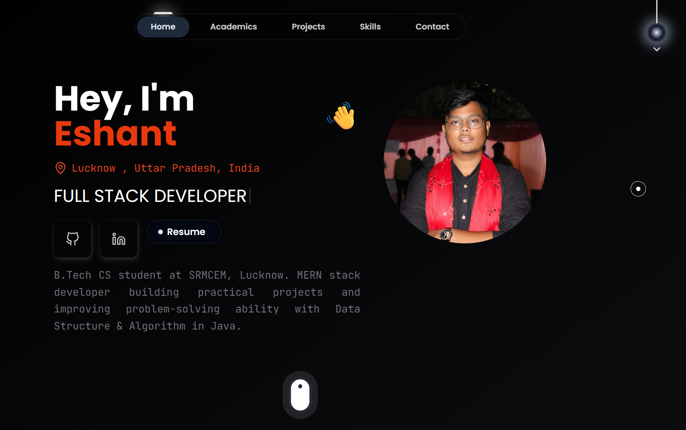

# 🚀 Eshant Agrahari — Developer Portfolio

Welcome to my first ever portfolio website:  
This site showcases who I am — developer, creator, and builder — in the simplest yet most impactful way.

---

## 📌 About Me

Hey, I’m **Eshant Agrahari**, currently pursuing B.Tech in Computer Science at **SRMCEM Lucknow**. I love building modern web apps, exploring full-stack development, and crafting beautiful yet functional interfaces. My current tech stack revolves around the **MERN** ecosystem.

---

## ✨ Key Features

- 🌓 **Dark / Light Mode** 
- ⚡ Smooth Scroll-to-section navigation
- 🧠 **Minimalist Design** with clean layout and shadows

---

## 📬 Contact Me

If you like my work, let’s get in touch:

* 📩 Email: [eshant2711gmail.com](mailto:eshant2711@gmail.com)
* 🔗 [LinkedIn](https://www.linkedin.com/in/eshant-agrahari/)
* 💻 [GitHub](https://github.com/eshant27)

---
